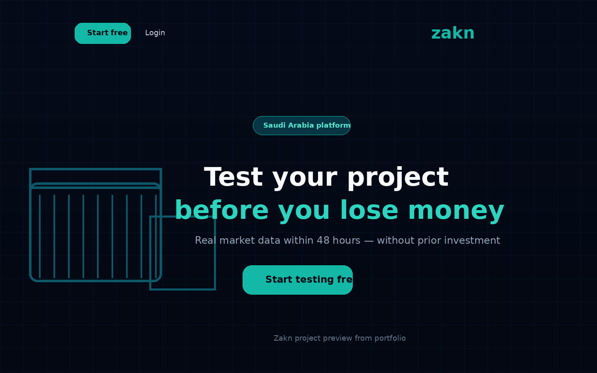
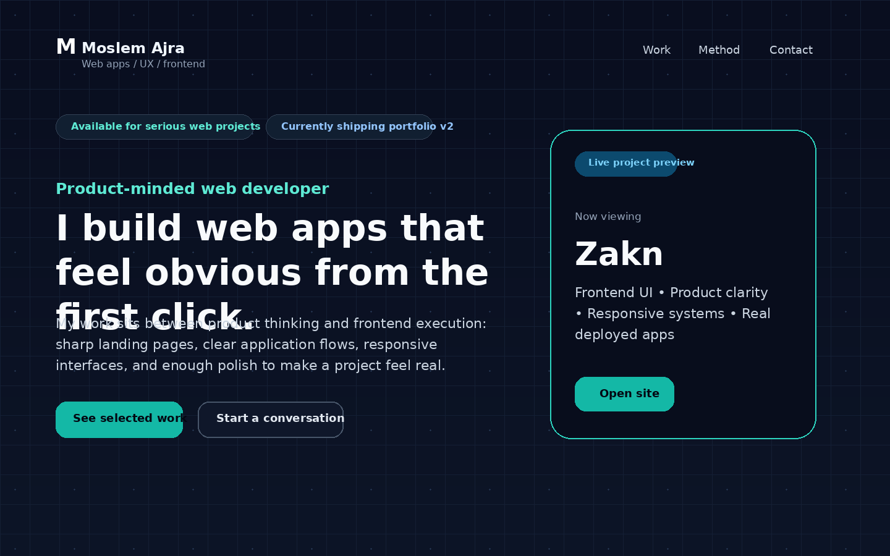
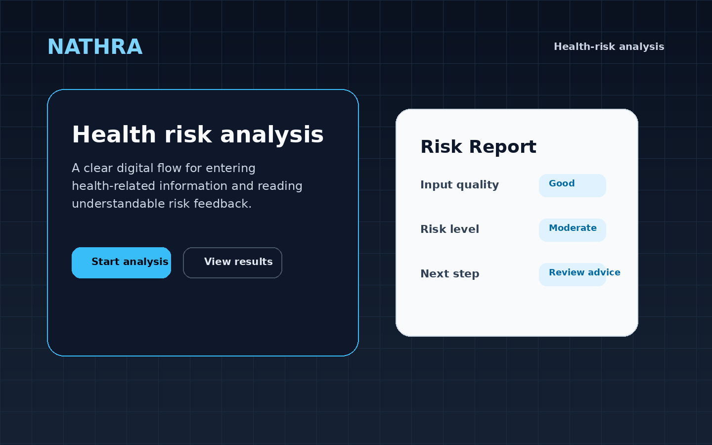

<div align="center">

# Moslem Ajra

### Product-Minded Web Developer  
#### React • TypeScript • Node.js • Express • MongoDB • PostgreSQL • AI-assisted Products

I build deployed web applications that feel clear, useful, and real from the first click.

[Portfolio](https://portofio-sigma.vercel.app/) • [Email](mailto:ajra.new.era@gmail.com) • [LinkedIn](ADD_YOUR_LINKEDIN_HERE)

</div>

---

## About Me

I am a web developer focused on building practical product-style applications, not only code exercises.

My work sits between frontend execution, product thinking, clean user flows, backend/API understanding, AI-assisted development, and teaching technical concepts clearly.

I care about building applications that people can understand quickly, use easily, and improve over time.

---

## Featured Work

### Ticketing — Microservices Learning Platform

A production-minded ticket marketplace built incrementally to explore microservice boundaries, database ownership, container orchestration, and reliable distributed-system design.

- [Source code and project overview](https://github.com/moslemajra85/ticketing-app)
- [System architecture](https://github.com/moslemajra85/ticketing-app/blob/main/docs/system-architecture.md)
- Current milestone: authentication service with validated signup, password hashing, MongoDB persistence, Docker, Kubernetes, Ingress NGINX, and Skaffold
- Focus: backend architecture, service isolation, Kubernetes networking, security, and production-readiness trade-offs

> Status: active development. The repository clearly separates implemented capabilities from the planned event-driven marketplace architecture.

---

### Zakn

A product-validation web app designed to help founders test project ideas before wasting money on the wrong direction.



- Live Demo: https://zakintest-c7j3qezy.manus.space/
- Portfolio Preview: https://portofio-sigma.vercel.app/
- Focus: product clarity, landing page communication, responsive UI, founder-focused experience

---

### Portfolio Website

A product-minded developer portfolio designed as a proof page, not only a resume page.



- Live Demo: https://portofio-sigma.vercel.app/
- Code: ADD_YOUR_PORTFOLIO_REPO_LINK_HERE
- Focus: responsive interface, project presentation, positioning, UX clarity

---

### NATHRA

A health-risk analysis web app focused on making health-related information easier to understand through a clear digital experience.



- Live Demo: https://nathra.vercel.app/
- Code: https://github.com/moslemajra85/nathra
- Focus: product flow, health-risk analysis, frontend clarity, deployed prototype

---

## Current Focus

```txt
Frontend quality
Backend/API design
AI-assisted applications
Testing and CI/CD
Docker and deployment
Production-minded project structure
```

---

## Tech Stack

### Frontend


### Backend


### Tools


---

## How I Build

I try to approach projects like products:

1. Understand the user problem.
2. Design a clear flow.
3. Build the smallest useful version.
4. Deploy it.
5. Document the decisions.
6. Improve the structure.
7. Add production-minded features.

---

## GitHub Direction

My GitHub is being cleaned and upgraded around serious, readable, deployed projects.

The goal is simple:

> Each public repository should explain what the project does, why it exists, how it works, and what I learned from it.

---

## Contact

- Portfolio: https://portofio-sigma.vercel.app/
- Email: ajra.new.era@gmail.com
- LinkedIn: ADD_YOUR_LINKEDIN_HERE
